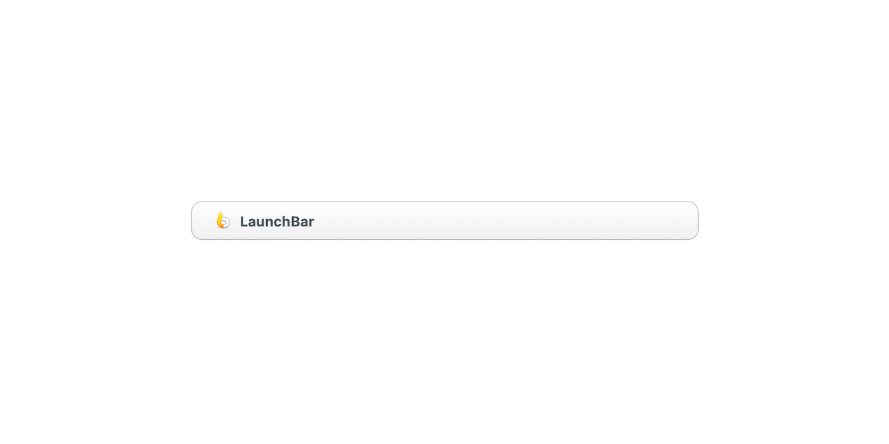
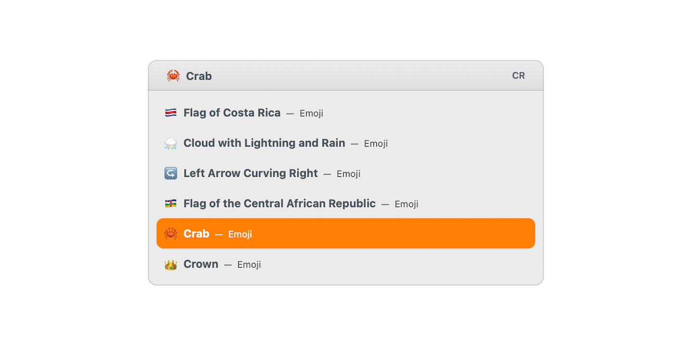
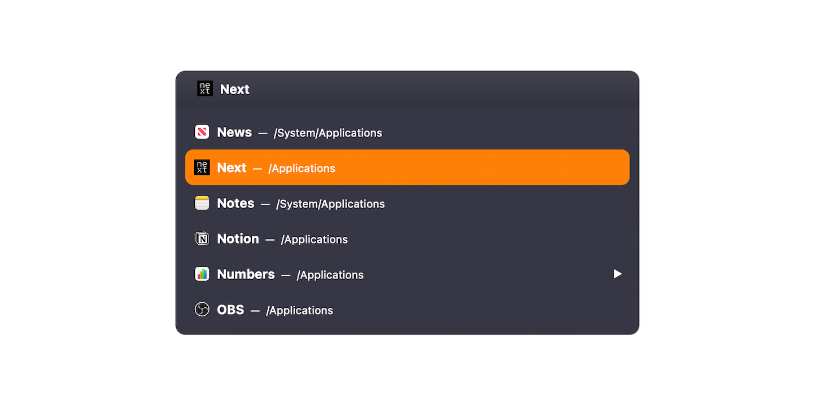

# Assimilated (LaunchBar Theme)

Assimilated is a theme for [LaunchBar 6][lb]. It's meant to make LaunchBar fit
in with the redesigned window chrome introduced with macOS 11 Big Sur. It also
attempts to capture the spirit of LaunchBar 5's default theme, Small (also known
as Vintage in LaunchBar 6).

This theme is the successor to [Bijou][bi], a theme that mimics the window
chrome from the Yosemite–Catalina era of macOS 10.

Assimilated comes with a white, a light, and a dark variant.

## Installation

Download [this repository as a .zip file][dl] and open the **Assimilated
White.lbtheme**, **Assimilated Light.lbtheme** and **Assimilated Dark.lbtheme**
files.

If you want to remove Assimilated in the future, you can find the installed
`.lbtheme` files in your `~/Library/Application Support/Launchbar/Themes/`
directory.

## Acknowledgements

I honestly can't believe I've made a LaunchBar 6 theme at the cusp of 2021.
LaunchBar 6 was released over six years ago--And Bijou (originally called El
Capitan Small) was released five years ago. So thanks to [Objective
Development][od] for being such a part of my life?

[bi]: https://github.com/benjaminwil/bijou
[dl]: https://github.com/benjaminwil/assimilated/archive/main.zip
[lb]: https://www.obdev.at/products/launchbar/index.html
[od]: https://www.obdev.at

